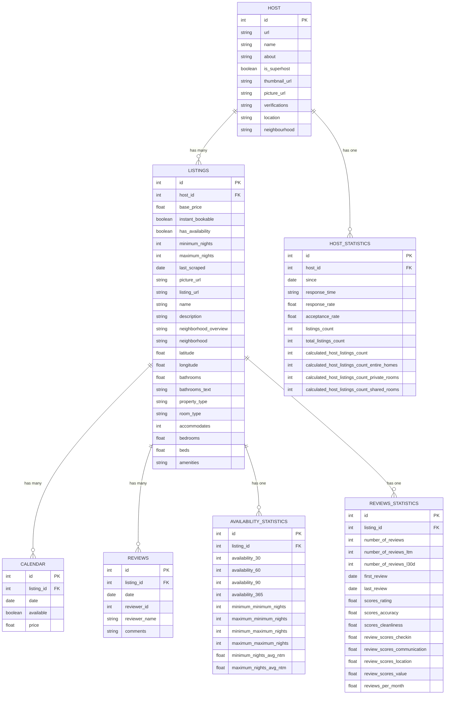

# Advanced Databases Project - Report

## Phase 1 - December 2024

## 1 Introdução

Este relatório descreve o trabalho realizado na Fase 1 do projeto de Bases de Dados Avançadas, cujo objetivo é comparar bases de dados relacionais e NoSQL, explorando diferenças na modelação de dados, execução de queries e estratégias de otimização.

## 2 Dados

Para este projeto, selecionámos o dataset **New York Airbnb Open Data** disponível no Kaggle ([link](https://www.kaggle.com/datasets/rhonarosecortez/new-york-airbnb-open-data?select=listings.csv)).  
Este dataset contém dados sobre o mercado de alojamento da Airbnb na cidade de Albany, Nova Iorque, até ao dia 5 de setembro de 2024. As informações disponibilizadas estão organizadas em três ficheiros CSV, descritos abaixo:

- **listings.csv**: Contém detalhes sobre os tipos de propriedades, preços e características dos anfitriões.  
- **calendar.csv**: Regista a disponibilidade diária e os preços associados a cada propriedade.  
- **reviews.csv**: Inclui o feedback dos hóspedes sobre os anúncios individuais.  

Os três ficheiros estão relacionados entre si pelo campo comum `listing_id`, que permite ligar as informações de cada anúncio entre os diferentes ficheiros.

## 3 Tratamento dos Dados

A partir do dataset selecionado, efetuámos uma limpeza abrangente para garantir a consistência e qualidade dos dados. As principais ações realizadas foram:

- Conversão de colunas de datas para o formato `datetime`.  
- Conversão de colunas de preços para valores numéricos.  
- Conversão de colunas contendo "t" e "f" para valores booleanos (`True` e `False`).  
- Eliminação de colunas onde todos os valores eram `null`.  
- Tratamento de colunas parcialmente nulas:  
  - Análise caso a caso, com estratégias como preenchimento com a moda, média ou mediana, conforme apropriado.  
  - Utilização de valores booleanos ou placeholders para colunas onde fazia sentido.  

Estas operações foram realizadas no ficheiro `scripts/datacleaning.ipynb`, que apresenta detalhadamente os passos do pré-processamento.

## 4 Relação dos Dados

Após o tratamento inicial, elaborámos um esquema relacional para organizar os dados de forma eficiente e coerente. Este esquema encontra-se representado no diagrama abaixo:

Os dados tratados foram, então, organizados em **DataFrames** que correspondem às tabelas idealizadas no esquema relacional.  
Estes **DataFrames** foram guardados no diretório `data/clean/data/` para utilização em fases futuras do projeto.  

O processo de organização dos dados encontra-se também no ficheiro `scripts/datacleaning.ipynb`.

## 5 Base de Dados SQL

A implementação da base de dados relacional MySQL foi realizada no ficheiro `scripts/mysql.ipynb`.  
Com base no esquema relacional apresentado anteriormente, criámos um ficheiro SQL `schemas/dbschema.sql`, que contém os comandos necessários para a criação das tabelas. Este ficheiro foi utilizado para configurar a estrutura da base de dados no MySQL.  

Após a criação das tabelas, os dados previamente tratados foram carregados para a base de dados. Durante este processo, garantimos a correspondência entre os tipos de dados dos **DataFrames** utilizados e os campos das tabelas SQL.  

Implementámos e testámos duas **queries** simples e duas **queries** complexas, descritas abaixo:

**Queries Simples:**  
- Airbnbs disponíveis com 2 quartos e preço inferior a $100.  
- Pesquisa de anfitriões em Albany, NY, com mais de um anúncio na base de dados.  

**Queries Complexas:**  
- Aumentar o preço base (`base_price`) dos anúncios com alta pontuação em avaliações, um número elevado de avaliações e um preço médio elevado.  
- Identificar **hosts** em "New York, NY" com mais de 5 anúncios e um preço médio inferior a $150 para anúncios disponíveis, ordenados por preço médio.  

Para cada **query**, registámos o número de resultados obtidos e o tempo de execução, demonstrando a eficiência da base de dados na resposta a diferentes tipos de operações.

## 6 Base de Dados NoSQL

Para a criação da base de dados não-relacional, foi usado o **MongoDB**, através da biblioteca **PyMongo**, para além das bibliotecas **Pandas**, **json** e **time**.  
Uma vez criada a base de dados inicial, as coleções foram criadas com um esquema de validação em formato **JSON**, de modo a não permitir a adição de dados inválidos.  

Para estabelecer relações **one-to-many** e **one-to-one**, foram criadas duas **pipelines** para agregar os dados necessários, seguindo as mesmas relações da base de dados relacional.  

Após o carregamento dos dados, foram efetuadas duas **queries** simples e duas **queries** complexas, que realizam o mesmo objetivo das criadas para a base de dados relacional, indicando também o tempo de execução e o número de resultados obtidos.  

Todo o código escrito foi guardado no ficheiro `scripts/mongo.ipynb`.

## 7 Conclusão

Nesta Fase 1 do projeto, tratámos e organizámos os dados do dataset da Airbnb, criando bases de dados em MySQL e MongoDB.  
Implementámos um esquema relacional normalizado e coleções no MongoDB com validação de dados, garantindo consistência e qualidade.  

Testámos **queries** simples e complexas, analisando tempos de execução e número de resultados. O trabalho realizado constitui uma base sólida para as próximas fases, onde iremos focar na otimização e análise comparativa entre ambas as bases de dados.