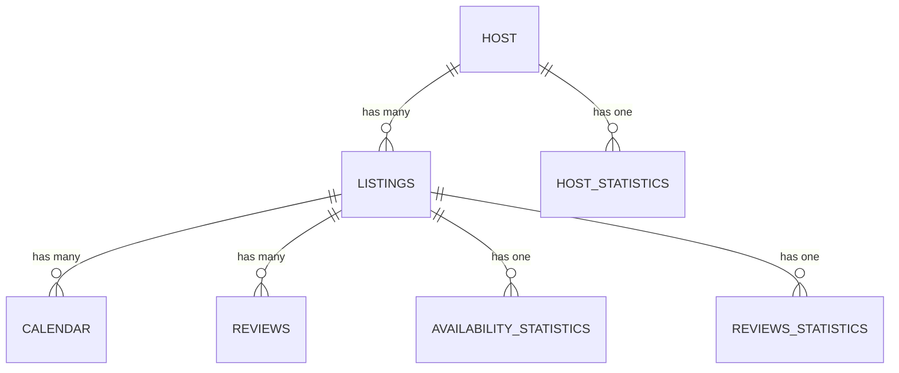
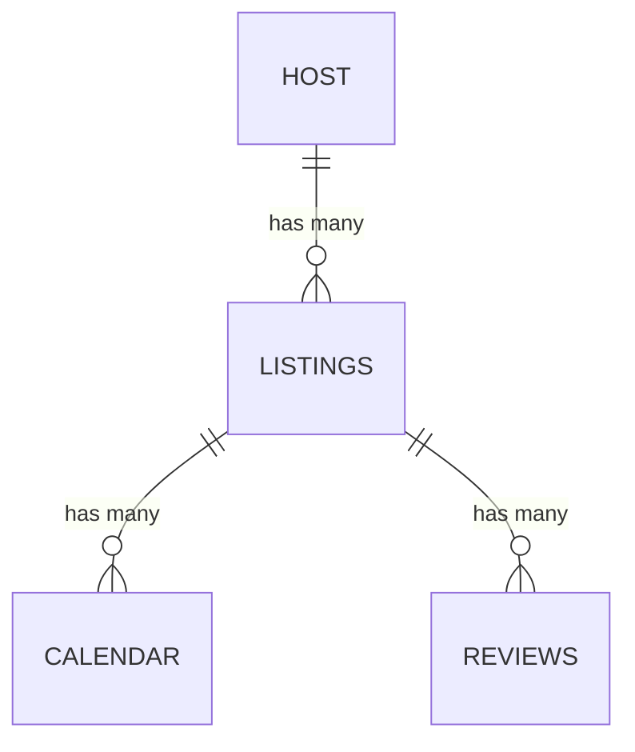

# Advanced Databases Project - Report

## December 2024

## 1. Introdução  

Este relatório apresenta o trabalho realizado na Fase 2 do projeto de Bases de Dados Avançadas, focando-se na otimização de operações em bases de dados relacionais e NoSQL. As melhorias implementadas visaram aumentar a eficiência das consultas, ajustando esquemas e índices para explorar melhor as capacidades de cada tecnologia.  

Foram realizados testes para comparar o desempenho antes e depois das otimizações, demonstrando ganhos em tempo de execução e redução de dependências desnecessárias. Este documento detalha as alterações aplicadas, os resultados obtidos e os impactos dessas mudanças no desempenho das bases de dados.  

## 2. Optimizações  

As otimizações incluíram ajustes no esquema de dados e reestruturação de queries, reduzindo tempos de execução e eliminando dependências desnecessárias. As subseções seguintes detalham as mudanças e os ganhos de desempenho.  

### 2.1 Esquema de Dados no MongoDB  

Com base no feedback do professor, foi identificado que o esquema original, ilustrado na **Figura 1: Esquema Original em MongoDB**, seguia uma estrutura semelhante à utilizada na base de dados relacional (MySQL). Apesar de funcional, este modelo não aproveitava as capacidades do MongoDB, devido ao elevado número de collections.  

**Alterações Implementadas**:  
- **Integração de Dados Relacionados (has one):**  
  Dados de coleções como `REVIEWS_STATISTICS` e `AVAILABILITY_STATISTICS` foram integrados diretamente em `LISTINGS`. Da mesma forma, dados da coleção `HOST_STATISTICS` foram integrados em `HOST`.  

- **Preservação de Relações (has many):**  
  As coleções `REVIEWS` e `CALENDAR` foram mantidas separadas devido ao volume elevado de dados, assim como a relação *has many* entre `HOST` e `LISTINGS`, permitindo consultas eficientes sobre múltiplos *listings* associados a cada *host*.

A Figura 1 mostra o esquema original, ainda utilizado no MySQL, enquanto a Figura 2 apresenta o novo esquema otimizado para MongoDB.  

## 2.2 MongoDB Query 1: Hosts em New York  

Foi incluído um `INSERT` na coleção `RESULTS` para armazenar os resultados, permitindo consultas futuras sem reprocessamento.  

**Alterações**:  
- **Adição do INSERT:**  
  Resultados do pipeline são armazenados na coleção `RESULTS`.  
- **Otimização do Pipeline:**  
  - `$match`: Filtra hosts em 'New York, NY', reduzindo documentos processados.  
  - `$lookup`: Junta `LISTINGS` e `HOSTS`, reduzindo dados carregados.  
  - `$addFields`: Isola *listings* disponíveis e calcula o preço médio.  
  - `$project`: Retorna apenas campos necessários.  

**Resultados**:  
- **Tempo de execução:** 0.2067 segundos.  
- **Resultados:** 6 hosts com mais de 5 listagens disponíveis e preço médio inferior a 150.

## 2.3 MongoDB Query 2: Atualização de Preços de Listings  

A query foi otimizada para processar apenas os documentos necessários, reduzindo a carga de processamento.  

**Alterações**:  
- **Seleção de Listings Relevantes:** Filtragem inicial com `review_scores_value > 4.5` e `number_of_reviews > 100`.  
- **Hosts Ativos:** Join com hosts em 'Albany, NY' com 5+ anúncios.  
- **Update:** Aumento de 10% nos preços base dos anúncios filtrados.  

**Resultados**:  
- **Tempo de execução:** 0.6688 segundos.  
- **Resultados atualizados:** 24 anúncios.

## 2.4 MySQL Query 1: Hosts em New York  

Adicionámos um `INSERT` à Query 1: Hosts em New York, conforme orientação do professor, para armazenar os resultados na tabela `RESULTS`, contendo `host_id`, `host_name`, `host_location`, `average_price` e `total_listings`. Esta alteração, semelhante ao implementado na **MongoDB Query 1: Hosts em New York**, descrita anteriormente, também visa a reduzir consultas repetidas. Neste processo, a query foi também otimizada.  

**Otimizações**:  
- **Subconjuntos:** *Common Table Expressions* (CTEs) separam o cálculo de preços médios (`average_prices`) e a contagem de listagens únicas (`host_with_high_listings`).  
- **Filtros:** Aplicação de `HAVING COUNT(DISTINCT l.id) > 5` para considerar apenas hosts com mais de 5 listagens únicas.  
- **JOINs:** Reduzem o custo computacional ao combinar apenas dados relevantes entre tabelas.  
- **Filtros:** Restringimos os resultados a hosts com preço médio inferior a 150 e localizados em `New York, NY`.  

**Resultados**:  
- **Tempo de execução:** 0.0061 segundos.  
- **Resultados:** 6 hosts com mais de 5 listagens únicas e preço médio inferior a 150.  

Tal como na implementação para **MongoDB**, a adição do `INSERT` e a reestruturação da query com CTEs resultaram em uma abordagem mais eficiente e escalável, facilitando a reutilização dos resultados e reduzindo o custo computacional.

## 2.5 MySQL Query 2: Atualização de Preços de Listings  

Nesta query, similarmente ao que foi feito no **MongoDB**, seguimos as sugestões do professor, aumentando a complexidade e otimizando a query.  

**Otimizações**:  
- **Seleção de Listings Relevantes:** Foi criada a CTE `high_reviewed_listings`, que filtra listings com `review_scores_rating > 4.5` e `number_of_reviews > 100`.  
- **Identificação de Hosts Ativos:** A CTE `active_hosts` identifica hosts com `5+ anúncios` e `3+ disponíveis`, agregando dados de `HOST_STATISTICS` e `LISTINGS`.  
- **UPDATE Direcionado:** O `UPDATE` ajusta o `base_price` em 10% apenas para `listings` que atendem aos critérios filtrados.  

**Atualização**:  
- O `UPDATE` foi aplicado diretamente na consulta filtrada, eliminando a necessidade de realizar múltiplas operações ou consultas na tabela.  

**Resultados**:  
- **Tempo de Execução:** 0.2389 segundos.  
- **Resultados Atualizados:** 24 anúncios.  

Ao integrar o `UPDATE` na lógica da query e otimizar o escopo com CTEs, foi possível garantir que apenas os `listings` relevantes fossem processados, resultando numa execução mais eficiente.

## 2.6 Otimizações menores  

- Especificámos `dtypes` explícitos no carregamento dos dados para garantir consistência, evitar tipos mistos e melhorar o desempenho em operações com strings. Esta melhoria assegura dados limpos e preparados para a Fase 2, permitindo o carregamento eficiente dos dados dos `DataFrames` para ambas as bases de dados.  
- Adicionámos blocos `try...except` nas queries para aumentar a robustez e tratar erros como problemas de sintaxe ou conexão, sem interromper o programa. Esta alteração facilita o debug, mantém o código modular e torna as operações mais resistentes para maiores conjuntos de dados ou queries mais complexas.

# 3 Indexação  

Para melhorar o desempenho das queries desenvolvidas na Fase 2, aplicámos índices em ambas as bases de dados (relacional e NoSQL). Abaixo apresentamos a lógica aplicada e os benefícios obtidos.

## 3.1 MongoDB Query 1: Hosts em New York  

Nesta query, os índices otimizam as operações mais pesadas, que podem aceder a mais documentos, do pipeline:  

- **Índice em `location` (Hosts):**  
  - Suporta a operação `$match` para filtrar hosts na localização `New York, NY`.  
- **Índice em `has_availability` (Listings):**  
  - Otimiza a filtragem de listings disponíveis, acelerando o processamento.  
- **Índice em `host_id` (Listings):**  
  - Melhora a eficiência da operação `$lookup`, que associa `LISTINGS` a `HOSTS`.  

**Resultados**:  
- **Antes dos Índices:** 6 registos inseridos em 0.2067 segundos.  
- **Depois dos Índices:** 6 registos inseridos em 0.1710 segundos.  

Os índices aplicados reduziram significativamente o número de documentos processados nas operações `$match` e `$lookup`.  

## 3.2 MongoDB Query 2: Atualização de Preços de Listings

Para esta query, aplicámos índices que otimizam as operações de consulta e atualização, reduzindo significativamente o tempo de execução e o número de documentos processados.

- **Índice composto em `review_scores_value` e `number_of_reviews` (Listings):**  
  Facilita a filtragem inicial de listings altamente avaliados com `review_scores_value > 4.5` e `number_of_reviews > 100`.  
- **Índice simples em `host_id` (Listings):**  
  Melhora a eficiência da operação `$lookup` entre `Listings` e `Hosts`.  
- **Índice simples em `id` (Hosts):**  
  Otimiza a associação entre `Listings` e `Hosts` na operação `$lookup`.  
- **Índice composto em `location` e `total_listings_count` (Hosts):**  
  Acelera a filtragem de hosts em 'Albany, NY' com mais de 5 listings.  
- **Índice composto em `has_availability`, `base_price` e `id` (Listings):**  
  Otimiza a filtragem final de listings disponíveis, com `base_price < 300`, para a operação de atualização.  

**Resultados**:  
- **Antes dos Índices:** 24 registos atualizados em 0.6688 segundos.  
- **Depois dos Índices:** 24 registos atualizados em 0.4839 segundos.  

Os índices aplicados foram importantes para acelerar tanto as operações de filtragem quanto as de atualização (`update_many`).

## 3.3 MySQL Query 1: Hosts em New York  

Nesta query, os índices aplicados foram essenciais para otimizar as operações mais intensivas, reduzindo o tempo de execução e garantindo um desempenho mais eficiente.  

- **Índice em `host_id` (LISTINGS):**  
  Melhora a performance do `JOIN` entre `LISTINGS` e `HOST_STATISTICS`.  
- **Índice em `location` (HOST):**  
  Otimiza o filtro de localização na cláusula `WHERE`, para `New York, NY`.  
- **Índice composto em `has_availability` e `base_price` (LISTINGS):**  
  Acelera a filtragem de anúncios disponíveis e com `base_price < 150`.  
- **Índice composto em `listings_count` (HOST_STATISTICS):**  
  Otimiza a filtragem de hosts com mais de 5 listings.  

**Resultados**:  
- **Antes dos Índices:** 6 registos inseridos em 0.0113 segundos.  
- **Depois dos Índices:** 6 registos inseridos em 0.0037 segundos.  

Os índices reduziram significativamente o número de linhas processadas, acelerando tanto as operações de `JOIN` quanto as filtragens na `WHERE`. Essa abordagem demonstrou um aumento de eficiência.

## 3.4 MySQL Query 2: Atualização de Preços de Listings  

Nesta query, índices foram aplicados para otimizar as operações de atualização em grande escala, reduzindo significativamente o tempo de execução e os recursos necessários para processar os dados.  

**Índices Aplicados**  

- **Índice em `id` (LISTINGS):**  
  Suporta a associação entre `LISTINGS` e `REVIEWS_STATISTICS`, permitindo filtrar anúncios específicos para a atualização.  
- **Índice composto em `base_price` e `has_availability` (LISTINGS):**  
  Otimiza a filtragem de anúncios disponíveis com preço abaixo de 300, reduzindo o número de registros analisados.  
- **Índice em `listing_id` (REVIEWS_STATISTICS):**  
  Facilita a associação de estatísticas de avaliação a anúncios específicos.  
- **Índice composto em `number_of_reviews` e `review_scores_rating` (REVIEWS_STATISTICS):**  
  Acelera a seleção de anúncios altamente avaliados (`review_scores_rating > 4.5` e `number_of_reviews > 100`).  

**Resultados**  
- **Antes dos Índices:** 24 registros atualizados em 0.2501 segundos.  
- **Depois dos Índices:** 24 registros atualizados em 0.0143 segundos.  

Os índices aplicados reduziram o tempo de execução, com destaque para as melhorias na filtragem de dados e na associação entre tabelas.

# 4 Alterações no Esquema e Modelo de Dados  

Descrevemos mudanças no esquema relacional e no modelo NoSQL para reduzir dependências e melhorar o desempenho das queries.

## 4.1 Esquema Relacional (MySQL)  

Durante a análise das queries, identificámos que os campos `review_scores_rating` e `number_of_reviews`, frequentemente utilizados em condições e filtros, eram acessados através de uma junção com a tabela `REVIEWS_STATISTICS`. Essa abordagem aumentava o custo computacional das queries devido ao custo dos `JOINs`.  

Para resolver este problema, decidimos mover os campos `review_scores_rating` e `number_of_reviews` diretamente para a tabela `LISTINGS`, reduzindo a dependência da tabela `REVIEWS_STATISTICS`.  

**Impacto nas Queries**  
- **Query 2: Atualização de Preços de Listings**  
  Após a alteração, a nova query eliminou a necessidade da junção com `REVIEWS_STATISTICS`, resultando na redução do tempo de execução.  
- **Query 1: Hosts em New York**  
  Não utilizava os campos movidos e, portanto, não sofreu impacto no desempenho.  

**Resultados**  
- **Query 2:** A nova versão aproveita diretamente os campos em `LISTINGS`, otimizando significativamente o processamento:  
  - **Antes da Alteração do Esquema:**  
    - **Sem índices:** 0.2389 segundos.  
    - **Com índices:** 0.0187 segundos.  
  - **Após a Alteração do Esquema:**  
    - **Sem índices:** 0.0502 segundos.  
    - **Com índices:** 0.0168 segundos.  
- **Query 1:** O desempenho permaneceu consistente, pois não dependia da tabela `REVIEWS_STATISTICS`.  

A mudança no esquema relacional eliminou sobrecargas, otimizando queries que acessam diretamente `review_scores_rating` e `number_of_reviews`, ao invés de depender de `JOINs` na tabela `REVIEWS_STATISTICS`.  

Considerou-se adicionar `total_listings` à tabela `HOST` para simplificar a Query 1, mas optámos por não seguir com essa alteração para evitar antecipar cálculos das queries.

## 4.2 Modelo de Dados NoSQL (MongoDB)  

Ao considerar alterações ao modelo de dados em NoSQL para melhorar o desempenho, concluímos que as alterações já realizadas e descritas em **Otimizações, Esquema de Dados no MongoDB** eram suficientes para atender a esse objetivo.  

Estas mudanças incluíram a integração de dados relacionados diretamente nas coleções `Listings` e `Hosts`, eliminando `$lookup` desnecessários, enquanto mantivemos relações *has many*, como `Reviews` e `Calendar`, separadas para melhor escalabilidade.  

Assim, consideramos que nenhuma alteração adicional no modelo de dados seria necessária.  

## 5 Conclusão  

Nesta fase do projeto, foram realizadas otimizações significativas nos esquemas e operações de ambas as bases  
de dados, relacional e NoSQL. As alterações implementadas resultaram em ganhos de desempenho, reduzindo  
tempos de execução e eliminando dependências.  

No MongoDB, as mudanças no esquema de dados e a aplicação de índices demonstraram ser eficazes para  
simplificar operações e melhorar a escalabilidade. Já no MySQL, a reestruturação das queries com o uso de  
CTEs e ajustes no esquema relacional reduziram custos computacionais e melhoraram a eficiência das queries  
complexas.  

Os testes de desempenho confirmaram o impacto positivo dessas alterações, validando a abordagem adotada  
para explorar os pontos fortes de cada tecnologia. O projeto mostrou como otimizações bem direcionadas podem  
melhorar a performance de sistemas que lidam com grandes volumes de dados e queries complexas.  