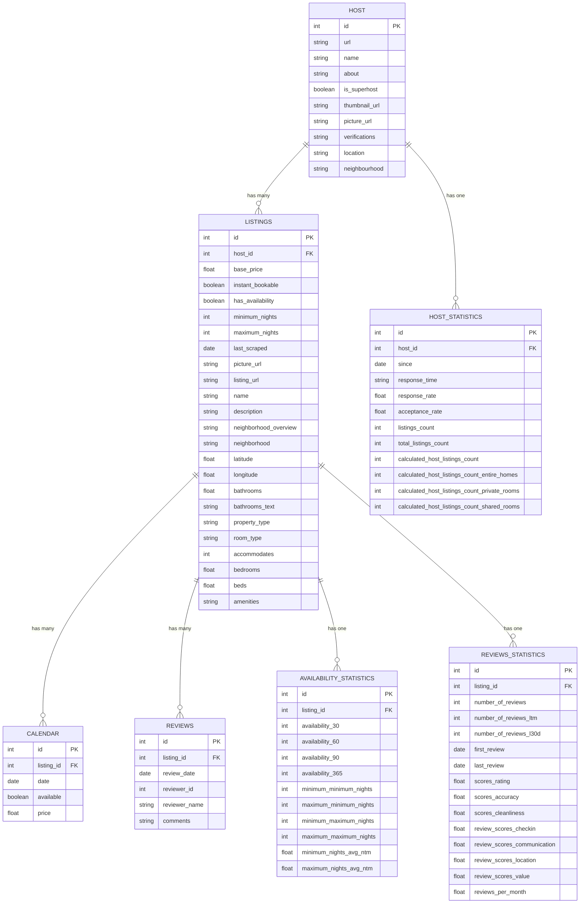
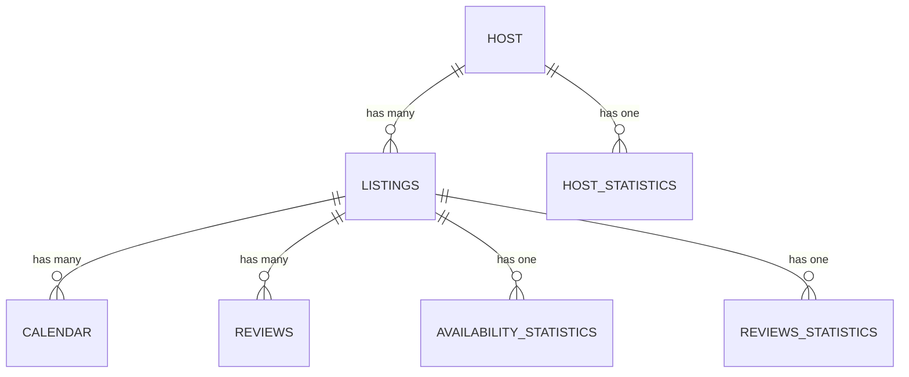

### ER Diagram

```mermaid
erDiagram
    LISTINGS {
        int id PK
        int host_id FK
        float base_price
        boolean instant_bookable
        boolean has_availability
        int minimum_nights
        int maximum_nights
        date last_scraped
        string picture_url
        string listing_url
        string name
        string description
        string neighborhood_overview
        string neighborhood
        float latitude
        float longitude
        float bathrooms
        string bathrooms_text
        string property_type
        string room_type
        int accommodates
        float bedrooms
        float beds
        string amenities
    }

    REVIEWS_STATISTICS {
        int id PK
        int listing_id FK
        int number_of_reviews
        int number_of_reviews_ltm
        int number_of_reviews_l30d
        date first_review
        date last_review
        float scores_rating
        float scores_accuracy
        float scores_cleanliness
        float review_scores_checkin
        float review_scores_communication
        float review_scores_location
        float review_scores_value
        float reviews_per_month
    }

    HOST {
        int id PK
        string url
        string name
        string about
        boolean is_superhost
        string thumbnail_url
        string picture_url
        string verifications
        string location
        string neighbourhood
    }

    HOST_STATISTICS {
        int id PK
        int host_id FK
        date since
        string response_time
        float response_rate
        float acceptance_rate
        int listings_count
        int total_listings_count
        int calculated_host_listings_count
        int calculated_host_listings_count_entire_homes
        int calculated_host_listings_count_private_rooms
        int calculated_host_listings_count_shared_rooms
    }

    CALENDAR {
        int id PK
        int listing_id FK
        date date
        boolean available
        float price
    }

    AVAILABILITY_STATISTICS {
        int id PK
        int listing_id FK
        int availability_30
        int availability_60
        int availability_90
        int availability_365
        int minimum_minimum_nights
        int maximum_minimum_nights
        int minimum_maximum_nights
        int maximum_maximum_nights
        float minimum_nights_avg_ntm
        float maximum_nights_avg_ntm
    }

    REVIEWS {
        int id PK
        int listing_id FK
        date review_date
        int reviewer_id
        string reviewer_name 
        string comments
    }

    LISTINGS ||--o{ CALENDAR : "has many"
    LISTINGS ||--o{ REVIEWS : "has many"
    LISTINGS ||--o{ AVAILABILITY_STATISTICS : "has one"
    LISTINGS ||--o{ REVIEWS_STATISTICS : "has one"

    HOST ||--o{ LISTINGS : "has many"
    HOST ||--o{ HOST_STATISTICS : "has one"
```

## Simplified

```mermaid
erDiagram
    LISTINGS ||--o{ CALENDAR : "has many"
    LISTINGS ||--o{ REVIEWS : "has many"
    LISTINGS ||--o{ AVAILABILITY_STATISTICS : "has one"
    LISTINGS ||--o{ REVIEWS_STATISTICS : "has one"

    HOST ||--o{ LISTINGS : "has many"
    HOST ||--o{ HOST_STATISTICS : "has one"
```